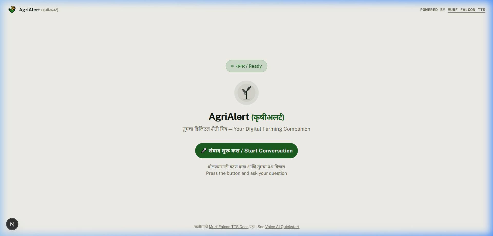

# 🌾 AgriAlert (कृषीअलर्ट) — Voice AI for Indian Farmers

AgriAlert is a voice AI assistant built for Maharashtra's farmers. It delivers crop advisory, real-time weather alerts, mandi prices, and agricultural guidance — all through natural Marathi conversation. Built for the **#VoiceForBharat Farm & Field** track, powered by Murf Falcon TTS and LiveKit.

<p align="center">
  
</p>

[](https://opensource.org/licenses/MIT) [](https://murf.ai/api/docs/text-to-speech/streaming) [](https://docs.livekit.io) [](https://www.typescriptlang.org/) [](https://www.python.org/)

---

## ✨ Features

- 🗣️ **Marathi Voice Conversations** — Natural Devanagari speech via Murf Falcon (Pooja voice)
- 🌤️ **Live Weather Alerts** — Real-time forecasts from Open-Meteo based on the farmer's district
- 💰 **Mandi Price Lookup** — Crop market prices by district (mock data, extensible)
- 🧠 **Caller Memory** — SQLite-backed memory remembers returning farmers (name, crop, district)
- 🔀 **Specialist Handoff** — Seamlessly transfers complex crop disease queries to an expert agent
- 🚨 **Human Escalation** — Creates support tickets for unresolved issues with consent
- 📲 **Real-time UI** — Live data cards pushed to the frontend via LiveKit DataChannels
- 🔒 **Privacy-first** — Explicit consent required before saving any personal data

---

## Architecture


---

## Why Murf Falcon

- **55ms model latency** — fastest production TTS
- **130ms time-to-first-audio** across 10+ global regions
- **$0.01/1000 characters** — up to 10x cheaper than alternatives
- **150+ voices** across 35+ languages
- **99.38% pronunciation accuracy**

---

## Quickstart

### Prerequisites

- **Python** 3.10+
- **[uv](https://docs.astral.sh/uv/)** — fast Python package manager
  ```bash
  # macOS/Linux
  curl -LsSf https://astral.sh/uv/install.sh | sh
  # Windows (PowerShell)
  powershell -ExecutionPolicy ByPass -c "irm https://astral.sh/uv/install.ps1 | iex"
  ```
- **Node.js** 18+
- **pnpm** — fast Node package manager
  ```bash
  npm install -g pnpm
  ```
- A [LiveKit](https://cloud.livekit.io/) project (free tier available)

### Step 1: Clone the repo

```bash
git clone https://github.com/code-with-parth/AgriAlert.git
cd AgriAlert
```

### Step 2: Set up environment variables

Create `.env.local` in both `backend/` and `frontend/` (copy from `.env.example` in each). You need:

| Variable             | Where to get it                                        | Required |
| -------------------- | ------------------------------------------------------ | -------- |
| `LIVEKIT_URL`        | LiveKit Cloud dashboard                                | Yes      |
| `LIVEKIT_API_KEY`    | LiveKit Cloud dashboard                                | Yes      |
| `LIVEKIT_API_SECRET` | LiveKit Cloud dashboard                                | Yes      |
| `MURF_API_KEY`       | [murf.ai/api/dashboard](https://murf.ai/api/dashboard) | Yes      |
| `DEEPGRAM_API_KEY`   | [deepgram.com](https://deepgram.com)                   | Yes      |
| `GOOGLE_API_KEY`     | [Google AI Studio](https://aistudio.google.com/)       | Yes      |

### Step 3: Install & run

**Option A — All-in-one (from repo root):**

```bash
# macOS/Linux
chmod +x start_app.sh && ./start_app.sh

# Windows (PowerShell)
.\start_app.ps1
```

**Option B — Separate terminals:**

```bash
# Terminal 1 — Backend agent
cd backend && uv sync && uv run python src/agent.py download-files
uv run python src/agent.py dev

# Terminal 2 — Frontend
cd frontend && pnpm install && pnpm dev
```

Open **http://localhost:3000**, click **संवाद सुरू करा / Start Conversation**, allow microphone access, and speak.

---

## Project Structure

```
AgriAlert/
├── backend/                 # Python voice agent (LiveKit Agents + Murf Falcon)
│   ├── src/
│   │   ├── agent.py         # Main agent — pipeline, system prompt, tools
│   │   ├── crop_specialist.py # Specialist agent for deep crop queries
│   │   └── db.py            # SQLite caller memory & analytics
│   ├── tests/               # LLM-judged evaluation tests
│   ├── .env.example         # Backend env template
│   └── pyproject.toml       # Python deps (uv)
├── frontend/                # Next.js UI for voice sessions
│   ├── app/
│   │   ├── page.tsx         # Main voice page
│   │   ├── dashboard/       # Analytics dashboard
│   │   └── api/token/       # LiveKit token endpoint
│   ├── components/          # UI (agents-ui, app config, theme)
│   ├── app-config.ts        # Branding, accent colors, visualizer
│   └── package.json         # Node deps (pnpm)
├── start_app.sh             # Start all services (macOS/Linux)
├── start_app.ps1            # Start all services (Windows)
└── README.md
```

---

## Configuration

### Voice

Edit the `tts=murf.TTS(...)` call in `backend/src/agent.py`:

```python
tts=murf.TTS(model="falcon", voice="Pooja", locale="mr-IN", style="Conversation")
```

Browse all voices: [Murf Voice Library](https://murf.ai/api/docs/voices-styles/voice-library)

### LLM

Default is **Gemini** (`gemini-3.5-flash-lite`). To switch to OpenAI, set `OPENAI_API_KEY` and update the `llm=` call in `agent.py`.

### STT

Default is **Deepgram Nova-3** with Marathi (`language="mr"`). Configurable in the `AgentSession(stt=...)` call.

---

## Deploy

### Backend → Railway

[](https://railway.com/deploy/tIVCF1?referralCode=cNjn2P&utm_medium=integration&utm_source=template&utm_campaign=generic)

### Frontend → Vercel

[](https://vercel.com/new/clone?repository-url=https://github.com/code-with-parth/AgriAlert&root-directory=frontend&env=LIVEKIT_URL,LIVEKIT_API_KEY,LIVEKIT_API_SECRET&project-name=agrialert&repository-name=agrialert)

Both services connect via **LiveKit** — use the same `LIVEKIT_URL`, `LIVEKIT_API_KEY`, and `LIVEKIT_API_SECRET` on both platforms.

---

## Links

- [Murf API Docs](https://murf.ai/api/docs)
- [Murf Voice Library](https://murf.ai/api/docs/voices-styles/voice-library)
- [LiveKit Agents Docs](https://docs.livekit.io/agents)
- [Deepgram Docs](https://developers.deepgram.com)

---

## License

MIT
